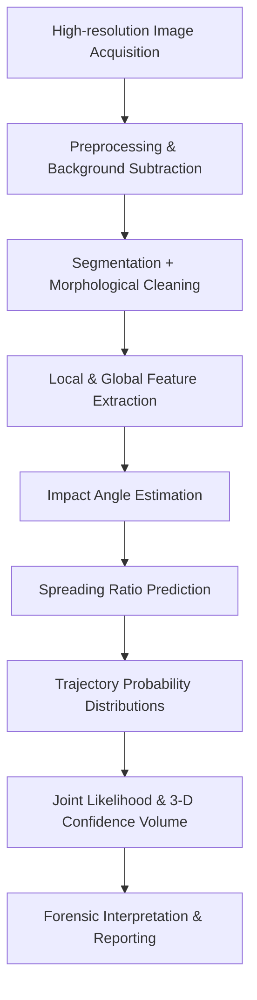

# bpa-multidisciplinary-review

Official Computational Companion Repository

Parth Pariwandh  
B.E. Mechanical Engineering (Class of 2027), Jadavpur University, Kolkata  
IEEE Student Member #100776649 · GATE ME 2026 (AIR 1871) · WorldQuant BRAIN Gold Level

> Prepared in connection with the confirmed short-term research internship under **Dr. Bahni Ray**, Associate Professor, Department of Mechanical Engineering, IIT Delhi (1 June 2026 – 31 July 2026; official letter dated 25 May 2026).

---

## Abstract

Bloodstain Pattern Analysis (BPA) requires physically faithful modeling, robust image processing, and transparent uncertainty quantification. This repository implements that multidisciplinary approach by providing production-ready Python code for fluid-dynamics utilities, an exact artificial neural network surrogate for maximum spreading ratio, automated quantitative feature extraction from bloodstain images, and probabilistic three-dimensional region-of-origin reconstruction. The goal is to deliver a reproducible, auditable, and academically defensible computational foundation for research and forensic applications.

---

## Repository Purpose

This repository serves as the computational companion to the review paper:

> **Bloodstain Pattern Analysis: A Multidisciplinary Review of Fluid Dynamics, Machine Learning, and Image Processing Approaches**  
> Parth Pariwandh, May 2026

It transforms the theoretical synthesis presented in the paper into executable, well-documented code while maintaining full scientific fidelity to the original equations, performance metrics, and conclusions.

---

## Connecting the Four Studies

| Paper                        | Core Problem                          | Key Method                                      | Key Result                              |
|-----------------------------|---------------------------------------|--------------------------------------------------|-----------------------------------------|
| Choudhury et al. (2023)     | Predicting β_max under roughness      | Exact 4-4-1 ANN with normalized inputs           | R² = 0.78 (blind test); roughness is critical |
| Joris et al. (2014)         | Accurate impact-angle estimation      | Active Bloodstain Shape Model + polynomial regression | RMSE 1.44°; 89% within 2°              |
| Attinger et al. (2019)      | 3-D region of origin with uncertainty | Physics-constrained probabilistic trajectories   | Error ≤ 10 cm; no systematic bias      |
| Arthur et al. (2017)        | Objective pattern description         | Automated segmentation + local/global features   | Reduced subjectivity and improved repeatability |

---

## Unified BPA Workflow




## Key Capabilities

- **Exact ANN implementation** of the trained 4-4-1 network for maximum spreading ratio β_max (Eq. 9 from the review paper)
- **Automated image-processing pipeline** reproducing the 12 local and global features defined by Arthur et al. (2017)
- **Probabilistic 3-D region-of-origin** reconstruction following Attinger et al. (2019)
- **Impact-angle estimation** using both classical ellipse fitting and the ABSM polynomial regression
- **Physics utilities** for Weber, Reynolds, and Ohnesorge numbers
- Publication-quality visualizations and fully documented Jupyter notebooks


## Critical Analysis

Traditional analytic models for droplet spreading break down when surface roughness and low-to-moderate Reynolds/Weber regimes dominate. The ANN approach captures these effects without requiring simplifying assumptions about flow geometry.

Surface roughness (ra) emerges as the most influential parameter in the sensitivity analysis. Its omission, common in legacy models, significantly degrades predictive accuracy.

The Active Bloodstain Shape Model outperforms simple ellipse fitting particularly in the 20–50° impact-angle range, where stain distortion violates the assumptions of the inverse-sine rule.

Probabilistic region-of-origin estimation replaces the single-point certainty of the string method with likelihood volumes, providing a more honest representation of uncertainty and eliminating the systematic height overestimation observed in deterministic approaches.

Automated extraction of local and global features shifts BPA from subjective, mechanism-based classification toward repeatable, observation-driven description — an important step toward greater admissibility in forensic testimony.


## Relevance to Research Internship at IIT Delhi

The repository integrates fluid dynamics, machine learning for physical systems, image analysis, and statistical inference within a single coherent framework. This mirrors the multidisciplinary rigor expected in advanced mechanical engineering research, including the environment of Dr. Bahni Ray’s laboratory at IIT Delhi.


## Quickstart

bash
git clone https://github.com/parthpariwandh/bpa-multidisciplinary-review.git
cd bpa-multidisciplinary-review

python -m venv .venv
source .venv/bin/activate          # Windows: .venv\Scripts\activate
pip install -r requirements.txt
pip install -e .
```

Example usage

python
from bpa.ann import predict_beta_max
from bpa.image_pipeline import analyze_pattern

beta = predict_beta_max(Re=3200, We=500, theta_rad=1.05, ra_nm=450)
print(f"Predicted β_max: {beta:.3f}")

features = analyze_pattern("example_stain.png")
print(features)
```


## Future Directions

- Integration of Physics-Informed Neural Networks (PINNs) for trajectory constraints
- Validation against larger, real-world bloodstain datasets
- Enhanced uncertainty quantification and sensitivity tools
- Substrate-specific calibration modules


## Citation

Please cite this repository using the `CITATION.cff` file and the BibTeX entry provided in `paper/references.bib`.

---

## License

This repository is released under the **MIT License**.

---

Maintained by Parth Pariwandh (Jadavpur University)
