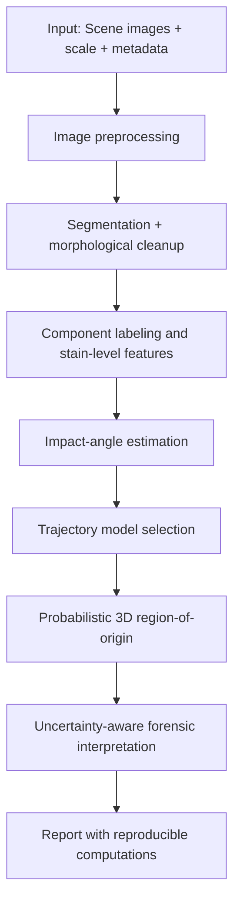

# bpa-multidisciplinary-review

## Bloodstain Pattern Analysis: Computational Companion Repository

**Parth Pariwandh**  
B.E. Mechanical Engineering (Class of 2027), Jadavpur University, Kolkata  
IEEE Student Member #100776649 · GATE ME 2026 (AIR 1871) · WorldQuant BRAIN Gold Level

> This repository was prepared as the official computational companion and professional portfolio artifact for the 32-page review paper:
> **“Bloodstain Pattern Analysis: A Multidisciplinary Review of Fluid Dynamics, Machine Learning, and Image Processing Approaches” (May 2026).**
>
> The work was prepared in connection with a confirmed short-term research internship under **Dr. Bahni Ray**, Associate Professor, Department of Mechanical Engineering, **IIT Delhi** (1 June 2026–31 July 2026; official letter dated 25 May 2026).

---

## Abstract and Motivation

Bloodstain Pattern Analysis (BPA) remains one of the most visible interfaces between engineering science and forensic interpretation. Yet the field has historically struggled with three linked difficulties: (i) simplified physical models that cannot fully capture real-world complexity, (ii) image-based methods that rely on manual interpretation and can induce inter-analyst variability, and (iii) deterministic origin-reconstruction methods that provide a single answer without explicit uncertainty. The review paper motivating this repository addresses these limits through a multidisciplinary framework integrating fluid dynamics, machine learning, image processing, and probabilistic statistics.

At the fluid-mechanics level, droplet spreading and impact-angle inversion demand models that honor viscosity, inertia, capillarity, and substrate effects simultaneously. The review demonstrates that roughness is not a cosmetic perturbation but a governing variable that can strongly alter spread and shape. At the algorithmic level, the repository captures the exact ANN equation from Eq. (9), preserving coefficients and normalization exactly as documented. At the geometric level, the repository compares traditional ellipse fitting with a higher-order polynomial correction shown to perform more robustly in the 20–50° regime where uncertainty has historically been high. At the scene-level inference stage, probabilistic 3-D region-of-origin methods replace point estimates with full likelihood surfaces.

This companion repository is intentionally practical: every core method is implemented in importable Python modules; each module is demonstrated in educational notebooks; and all outputs are built for reproducibility and citation. The purpose is not only to reproduce results from the paper but also to establish a durable research foundation for extension during and beyond the IIT Delhi internship period.

---

## Repository Structure

```text
bpa-multidisciplinary-review/
├── README.md
├── LICENSE
├── .gitignore
├── requirements.txt
├── CITATION.cff
├── CONTRIBUTING.md
├── CODE_OF_CONDUCT.md
├── src/
│   └── bpa/
│       ├── __init__.py
│       ├── ann.py
│       ├── physics.py
│       ├── image_pipeline.py
│       ├── impact_angle.py
│       └── probabilistic_roi.py
├── notebooks/
│   ├── 01_ann_beta_max.ipynb
│   ├── 02_image_processing_pipeline.ipynb
│   ├── 03_impact_angle_estimation.ipynb
│   ├── 04_probabilistic_region_of_origin.ipynb
│   └── 05_unified_bpa_workflow.ipynb
├── figures/
├── data/
│   └── README.md
├── docs/
│   ├── conf.py
│   ├── index.rst
│   └── modules.rst
├── paper/
│   ├── README.md
│   └── references.bib
└── tests/
    ├── test_ann_and_physics.py
    └── test_impact_and_roi.py
```

---

## Connecting the Four Studies

| Paper | Core problem | Key method | Key result |
|---|---|---|---|
| ANN droplet-spreading study (Pariwandh, review synthesis) | Predicting maximum spread ratio under oblique impact with roughness effects | 4-4-1 ANN with normalized inputs and tansig activations | High-fidelity β_max predictions; roughness-sensitive behavior captured better than legacy correlations |
| Joris et al. (2014) | Reliable impact-angle recovery from stain morphology | ABSM polynomial correction vs inverse-sine ellipse fit | Significant error reduction, especially in the 20–50° interval |
| Attinger et al. (2019) | 3-D region-of-origin estimation with uncertainty | Probabilistic trajectory and height PDFs with joint likelihood | Error ≤ 10 cm and no systematic bias in experiments; interpretable uncertainty volume |
| Arthur et al. (2017) | Objective pattern-level feature extraction | Segmentation + morphology + connected components + quantitative descriptors | Automated local/global descriptors reduce subjective interpretation burden |

---

## Unified BPA Workflow (Page 26 Concept)



1. Acquire calibrated images and metadata.
2. Perform background subtraction and robust thresholding (Otsu/triangle).
3. Remove tails/noise using morphological operators and 8-connected labeling.
4. Extract local descriptors (angle, irregularities, tail/body ratio).
5. Estimate angle using both conventional and corrected formulations.
6. Build trajectory probability maps with explicit noise assumptions.
7. Fuse evidence with joint likelihood.
8. Report central estimate + uncertainty envelope.

---

## Deep Critical Analysis

### 1) Limits of traditional energy-balance models
Classical energy-balance approaches are valuable for intuition but often over-compress the physics into low-dimensional closures. They typically assume idealized dissipation pathways, smooth surfaces, and simplified geometry during impact and recoil. In real BPA settings, stains can involve oblique incidence, non-Newtonian effects, rough and chemically heterogeneous substrates, and partial splashing/satellite formation. These regimes create deviations that simple closures cannot fully absorb without ad hoc correction terms. The computational implementation in this repository therefore treats those models as baselines rather than endpoints.

### 2) Why surface roughness (ra) is essential
The review’s sensitivity discussion identifies roughness as a dominant variable in ANN-based spread prediction. Physically, roughness modifies contact-line pinning, local dissipation, and effective wetting behavior. Computationally, ignoring ra can produce systematic under- or over-estimation depending on substrate class. In this repository, the OVAT helper explicitly highlights this dependence and is designed to make roughness sensitivity visible for every input setting.

### 3) Why ABSM outperforms traditional ellipse fitting (20–50°)
Inverse-sine ellipse fitting presumes shape fidelity that degrades when edge distortion, tailing, or impact asymmetry increase. The 20–50° range is particularly vulnerable because morphology transitions rapidly with changing incidence, making small segmentation/fit errors produce larger angular deviations. The third-order polynomial correction absorbs these nonlinear effects empirically, yielding lower RMSE and improved within-2° accuracy.

### 4) Why probabilistic origin models outperform deterministic strings
Method-of-strings workflows can be intuitive in classroom demonstrations, but they produce crisp intersections where evidence is inherently noisy. Probabilistic methods represent uncertainty explicitly at each stain and then combine evidence statistically. This makes the result both scientifically stronger and courtroom-friendlier: analysts can present likelihood volumes and confidence statements rather than overconfident single-point claims.

### 5) Why automated quantitative features matter for admissibility
Forensic admissibility depends not only on domain expertise but also on repeatability, transparency, and quantifiable uncertainty. Automated local/global feature extraction reduces analyst-to-analyst variability and creates auditable, version-controlled evidence trails. The pipeline here is designed around that principle: deterministic transformations, inspectable parameters, and reproducible output artifacts.

---

## Relevance to Research Internship at IIT Delhi

The multidisciplinary architecture of this repository aligns directly with research training goals in Dr. Bahni Ray’s laboratory: rigorous mechanics grounding, data-centric modeling, and translational computational tools. Fluid dynamics modules formalize droplet-impact physics; ANN components demonstrate modern data-driven surrogates; image-processing workflows bring computer vision into quantitative forensic analysis; and probabilistic origin reconstruction integrates statistical inference with physically interpretable models. Together, these blocks form a coherent platform suitable for extension into advanced studies such as multiphase impact modeling, uncertainty quantification, and experiment-theory integration.

---

## Core Scientific Implementations

### A. Exact ANN model for β_max (Eq. 9, page 9)
- Implemented in `src/bpa/ann.py` as `predict_beta_max(Re, We, theta_rad, ra_nm)`.
- Uses exact normalization: `x̄ = 2*(x − xmin)/(xmax − xmin) − 1`.
- Uses exact coefficients and tansig activation structure from Eq. (9).
- Includes blind-test comparison table against legacy correlations.
- Includes OVAT sensitivity utility emphasizing roughness impact.
- Supported ranges (page 10):
  - `We: 1.1–2055`
  - `Re: 9–15860`
  - `theta_rad: 0.10–2.83`
  - `ra_nm: 1.3–6200`

### B. Dimensionless and physics utilities
Implemented in `src/bpa/physics.py`:
- Weber number
- Reynolds number
- Ohnesorge number
- Balthazard angle approximation `alpha ≈ asin(W/L)`

### C. Image processing pipeline (Arthur et al., pp. 22–24)
Implemented in `src/bpa/image_pipeline.py`:
- Background subtraction
- Otsu/triangle segmentation
- Morphological erosion/dilation tail cleanup
- 8-connected component labeling
- Local features:
  - impact angle `asin(minor/major)`
  - convex hull irregularity (Irreg1)
  - tail-to-body ratio
  - inscribed-circle irregularity (Irreg2)
- Global features:
  - linearity (3rd-degree polynomial fit to centroids)
  - gamma angle distribution
  - convex hull circularity `4πA/P²`
  - element density
- Includes synthetic generator targeting paper-style summary values.

### D. Impact angle estimation (Joris et al., 2014)
Implemented in `src/bpa/impact_angle.py`:
- Traditional ellipse inverse-sine estimator
- Polynomial correction: `α(s) = −0.05s³ + 0.85s² − 8.46s + 30.2`
- Accuracy comparison table structure included (RMSE and within-2°).

### E. Probabilistic 3-D region of origin (Attinger et al., 2019)
Implemented in `src/bpa/probabilistic_roi.py`:
- Trajectory passing PDF `ψ_ik`
- Height PDF `ϕ_ik(z)` with Gaussian tails
- Joint likelihood fusion over stains
- Experimental-pattern demonstration scaffold (HP 31, HP 7, HP 53, HP 11, HP 24, HP 21, C9)
- Scaling check helper for `V_RO ~ x₀^n`.

---

## Quickstart

### Installation

```bash
git clone https://github.com/parthpariwandh/Bloodstain-Pattern-Analysis-Review.git
cd Bloodstain-Pattern-Analysis-Review
python -m venv .venv
source .venv/bin/activate
pip install -r requirements.txt
pip install -e .
```

### ANN demo

```python
from bpa.ann import predict_beta_max, ovat_sensitivity

beta = predict_beta_max(Re=3200.0, We=500.0, theta_rad=1.05, ra_nm=450.0)
print(f"Predicted beta_max: {beta:.4f}")

effects = ovat_sensitivity(3200.0, 500.0, 1.05, 450.0)
print(effects)
```

### Image-processing demo

```python
from bpa.image_pipeline import generate_synthetic_pattern, analyze_pattern

img = generate_synthetic_pattern(seed=7, n_elements=420)
stats = analyze_pattern(img)
print(stats['count'], stats['elliptical_percent'], stats['mean_angle_deg'], stats['std_angle_deg'])
```

---

## Notebooks

- `notebooks/01_ann_beta_max.ipynb`
- `notebooks/02_image_processing_pipeline.ipynb`
- `notebooks/03_impact_angle_estimation.ipynb`
- `notebooks/04_probabilistic_region_of_origin.ipynb`
- `notebooks/05_unified_bpa_workflow.ipynb`

Each notebook contains equation-focused markdown, executable code cells, and interpretation notes.

---

## Reproducibility and Engineering Standards

- Type hints and modular APIs in `src/bpa/`
- Deterministic seeds for synthetic demos
- Unit tests for key mathematical utilities
- Figure generation scripts reproducible from notebook cells
- Sphinx-ready docs scaffold in `/docs`
- Citation metadata (`CITATION.cff`, `paper/references.bib`)

---

## Citation

If you use this repository, cite both software and paper metadata in `CITATION.cff`.

---

## Future Directions

1. Physics-Informed Neural Networks (PINNs) coupling trajectory ODE constraints with learned closures.
2. Larger real-scene datasets with calibration metadata and standardized annotation.
3. External validation on real forensic case-like patterns with blind analyst protocols.
4. Improved uncertainty quantification with hierarchical Bayesian trajectory ensembles.
5. Robustness studies across substrate roughness and absorbency classes.
6. Domain adaptation for camera viewpoint and illumination shifts.
7. Explainable ML overlays for courtroom-appropriate communication.
8. Integration with digital evidence management pipelines.

---

## Disclaimer

This repository is a research and educational resource. Operational forensic use requires validated protocols, laboratory QA/QC controls, and jurisdiction-specific legal standards.
